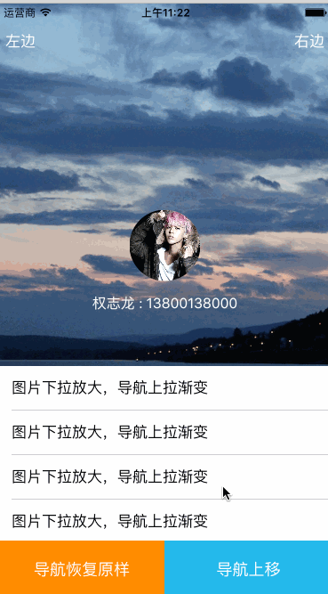

## UITableView HeaderView 动画

### 功能介绍：

1.下拉时头部视图 背景图片放大
2.下拉时导航栏颜色渐变特效
3.底部工具栏随着视图滚动 消失 或出现
4.导航栏的位移动画

####注意点：（`UINavigationBar+PS.m`）

1.对于想用颜色实现导航栏的颜色渐变特效。`UINavigationBar` 的属性 `translucent` 须为yes（系统默认）

2.在 `UINavigationBar index为0`的位置，插入视图时，该视图的`userInteractionEnabled` 必须为no,否则为影响到导航栏本身的交互，比如按钮的点击事件 `（- (void)ps_setBackgroundColor:(UIColor *)backgroundColor）`

3.给 `UINavigationBar`添加一个遮盖物，在控制器消失，最好还原成原样，从`NavigationBar`中删除 `（- (void)ps_reset
）`